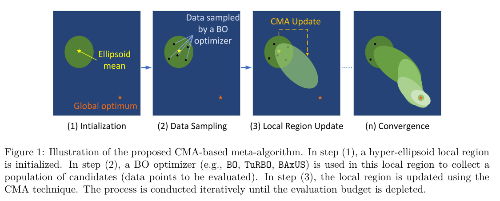

## Overview

Code for the CMA-Meta-Algorithm for Bayesian Optimization from ***High-dimensional Bayesian Optimization via Covariance Matrix Adaptation Strategy*** in the *Transactions on Machine Learning Research (TMLR)*. The OpenReview page can be found in this [link](https://openreview.net/forum?id=eTgxr7gPuU).



If you find our paper or this repo to be useful for your research, please consider citing:
```
@article{ngo2024cmabo,
  title={High-dimensional Bayesian Optimization via Covariance Matrix Adaptation Strategy},
  author={Ngo, Lam and Ha, Huong and Chan, Jeffrey and Nguyen, Vu and Zhang, Hongyu},
  journal={Transactions on Machine Learning Research},
  year={2024}
}
```

## Requirement and dependencies
- Install Anaconda/Miniconda.
- Install all dependencies listed in ```environment.yml``` file, or run the following to install via conda:
```
conda env create -f environment.yml
```
- If you want to run Lasso Benchmark, install the LassoBench library by:
```
cd test_functions/
pip install -e .
```
## Getting started
The main file is ```test-main.py```. To run the code for any problem, use the following syntax:
```
python test-main.py --solver <optimizer_name> -f <function_name> -d <input_dim> -n <number_of_iterations> --seed <seeding>
```
Available options for arguments:
- ```optimizer_name```: bo, turbo, baxus
- ```function_name```: alpine, levy, ellipsoid, rastrigin, shifted-alpine, shifted-levy, ellipsoid, rastrigin, branin500, schaffer100, lasso-dna, rover100, half-cheetah 
- ```input_dim```: an integer (only applicable for alpine, levy, ellipsoid, rastrigin, shifted-alpine, shifted-levy)
- ```number_of_iterations```: an integer to describe to iteration budget.
- ```seeding```: (optional) the random seed for random behavior of ```random```, ```numpy```, and ```torch```.

## Results from paper
We provide the settings for reproducing results presented in the paper ```experiments-from-paper.sh```.

# Acknowledgements

This implementation uses materials from the following public repositories to implement the CMA local regions and the incorporated BO optimizers. We thank the respective repository maintainers.
1. CMA-ES: Hansen, N., & Ostermeier, A. (2001). Completely derandomized self-adaptation in evolution strategies. Evolutionary computation, 9(2), 159-195.
   Code repo: https://github.com/CMA-ES/pycma
2. TuRBO: Eriksson, D., Pearce, M., Gardner, J. R., Turner, R., & Poloczek, M. (2019). Scalable global optimization via local Bayesian optimization. Advances in Neural Information Processing Systems, 32 (NeurIPS).
   Code repo: https://github.com/uber-research/TuRBO/
3. BAxUS: Papenmeier, L., Nardi, L., & Poloczek, M. (2022). Increasing the scope as you learn: Adaptive Bayesian optimization in nested subspaces. Advances in Neural Information Processing Systems, 35, (NeurIPS).
   Code repo: https://github.com/LeoIV/BAxUS

